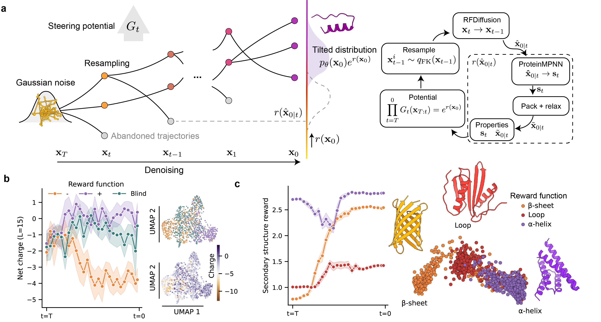

# FK-RFdiffusion
Feynman-Kac guided protein design using RFdiffusion. This package implements particle filtering to optimize design objectives during the diffusion process.

> **Disclaimer:**  We are currently working on making FK-RFdiffusion easily accessible through improved modifiability, documentation, package-managing and Colab notebooks. For now, follow the instructions below to install FK-RFdiffusion locally by cloning the repo.




## Overview

FK-RFdiffusion extends [RFdiffusion](https://github.com/RosettaCommons/RFdiffusion) with [Feynman-Kac particle filtering](https://arxiv.org/abs/2501.06848) for guided protein design. Instead of blind sampling, it guides the generative process toward desired properties.

## Installation

### 1. Clone this repository with submodules

FK-RFdiffusion is built as a wrapper around RFdiffusion. It also uses ProteinMPNN in its reward function. We therefore use have RFdiffusion and ProteinMPNN as submodules.

To install with submodules, use the `--recursive`. This will clone RFdiffusion and ProteinMPNN into externals.

```bash
git clone --recursive https://github.com/ErikHartman/fk-rfdiffusion.git
cd fk-rfdiffusion
```

If you already cloned without `--recursive`, initialize submodules:

```bash
git submodule update --init --recursive
```

### 2. Set up RFdiffusion Environment

First, follow the [RFdiffusion installation instructions](https://github.com/RosettaCommons/RFdiffusion) to set up the base environment. This includes creating a conda environment and setting up weights. If you can call the standard RFdiffusion `run_inference.py` script, you can continue. 


### 3. Install additional dependencies for FK-RFdiffusion

We have extra dependencies for the reward functions. PyDSSP is used for secondary structure computation and biopython for sequence-based features.

```bash
pip install pydssp biopython
```

### 3b. Install PyRosetta

Install pyrosetta according to the [documentation](https://pypi.org/project/pyrosetta-installer/).

## Quick start (examples)

### Binder design with interface $\Delta G$ guidance

```python
from fk_rfdiffusion.run_inference_guided import run_feynman_kac_design

run_feynman_kac_design(
    contigs=["A1-50/0 20"],           # Target residues A1-50, then 20-residue binder
    target_structure="target.pdb",     # Your target protein
    reward_function="interface_dG",    # Optimize binding energy
    num_designs=10,
    n_particles=20,                    # Number of parallel particles
    resampling_frequency=5,            # Resample every 5 steps
    guidance_start_timestep=30,        # Start guiding at timestep 30
    output_prefix="./designs/binder"
)
```

### Unconditional design with secondary structure guidance

```python
run_feynman_kac_design(
    contigs=["50"],                    # Design a 50-residue protein
    reward_function="alpha_helix_ss",  # Favor alpha helical structure
    num_designs=5,
    n_particles=15,
    output_prefix="./designs/helix"
)
```

## Available Reward Functions (current)

- `interface_dG` - Binding energy (lower is better)
- `alpha_helix_ss` - Alpha helix secondary structure content
- `beta_sheet_ss` - Beta sheet secondary structure content
- `loop_ss` - Loop/coil secondary structure content
- `sequence_hydrophobic` - Hydrophobic residue content
- `sequence_charged_positive` - Positive charge content
- `sequence_charged_negative` - Negative charge content

You can also pass a `custom_reward_fn`. More documentation soon!

See `fk_rfdiffusion/feynman_kac/reward/configs/presets.yaml` for full configuration options.

## Key Parameters

- `n_particles` - Number of parallel particles (more = better exploration, slower)
- `resampling_frequency` - How often to resample particles (lower = more guidance)
- `guidance_start_timestep` - When to start applying guidance (try 20-50)
- `potential_mode` - How to compute weights:
  - `"difference"` (default) - Based on reward improvement
  - `"immediate"` - Based on current reward
  - `"sum"` - Based on cumulative future reward
  - `"max"` - Based on maximum future reward
- `tau` - Temperature parameter for particle selection (auto-set per reward if None)

## Advanced Usage


## Citation

If you use this code, please cite:

- The RFdiffusion paper
- The ProteinMPNN paper
- This preprint

## License

[MIT](LICENSE)
